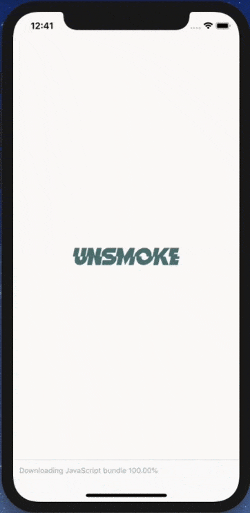

# Unsmoke
Overcome tobacco addiction with this habit-forming app!

## Demo

## Description
Unsmoke is meant to help you overcome difficulties on your path to a smoke-free life and gain control over the process of smoking.

This is a mobile app with exercises, tips and NLP techniques that help people overcome the tobacco addiction. The app has the simplest design possible.
## Ducks pattern
[Ducks](https://github.com/erikras/ducks-modular-redux) is a modular approach that collocates actions, action types and reducers, so you don't find yourself writing code in several different files every time you want to introduce a change into the redux store.

## i18n
[Localized](https://www.npmjs.com/package/i18n-js) software adapts to a specific language and culture by translating text into the user's language and formatting data in accordance with the user's expectations.

## Project debrief
The main challenges of the project were:
 - Build a mobile app for both major platforms
 - Transform 40,000 words on paper into a mobile app with authentication, profile dashboard, exercises, questionnaires, diary, achievements.
 - Authenticate users with firebase
 - Securely store user profiles in a database

The project was made entirely from scratch, including the app’s design and appearance.
